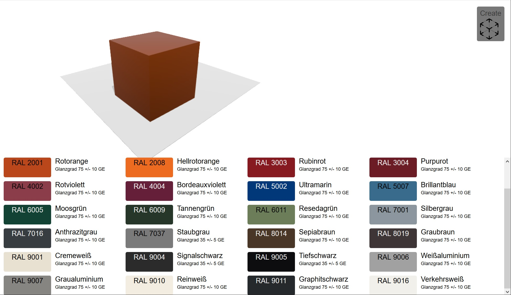

# quicklook-RAL-configurator

This repository is a fork of [elm-3d-scene](https://github.com/ianmackenzie/elm-3d-scene) by **@ianmackenzie**, a high-level Elm package for presenting 3D graphics in the browser.

It adds an example WebApp to the package's example folder (`examples/RALConfig.js`, transpiled from `examples/RALConfig.elm`  and `examples/RALConfig.html`) that features a **sample WebGL configurator to preview RAL colors on a metal block** including the ability to preview the product in AR (Augmented Reality) with **Apple AR Quicklook**, a feature available on macOS 10.15+ and iOS 12+.

# Disclaimer:

Just a subset of RAL colors was used here.

You can extend it yourself by using values from [Dezzpil/RAL-JSON](https://github.com/Dezzpil/RAL-JSON)

# How it works

The elm WebApp lets you configure a Cube with a color painting  in a WebGL view.
A subset of RAL standard colors is provided.

In any phase you can click the `Create AR-Quicklook button` shown top right. This will ...

* send the current 3D data as an USDA text file to the server, accompanied with an UUID.

* this is then converted to a binary USDC file and archived together with a 4k wood texture as an USDZ file. For this to work, you will also need the backend repository [USDZerveOnIIS](https://github.com/PixelPartner/USDZerveOnIIS)

* this USDZ file can then be downloaded by either clicking the then freshly appeared AR icon or using the QRCode presented on the left.

# Feedback

Any questions/feedback to this fork, please open an issue or reach out to **@pixelpartner**
on the [Elm Slack](https://elmlang.herokuapp.com) or on [twitter](https://www.twitter.com/pixelpartner)!
